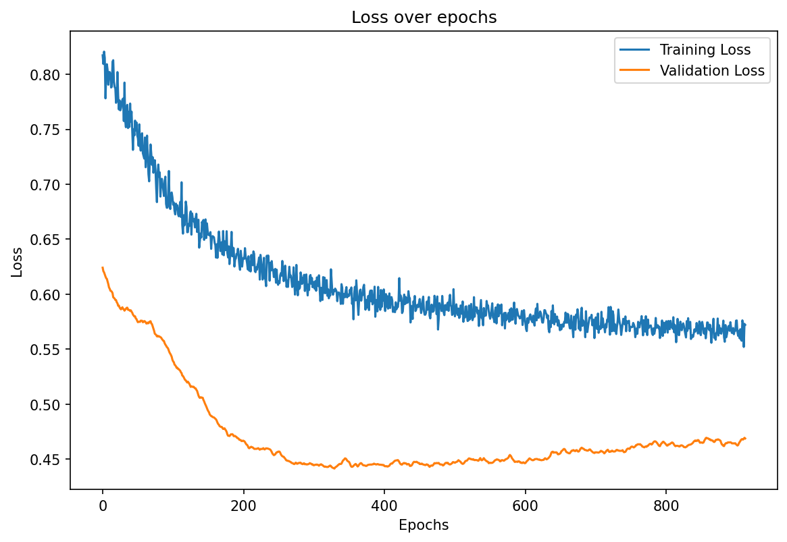
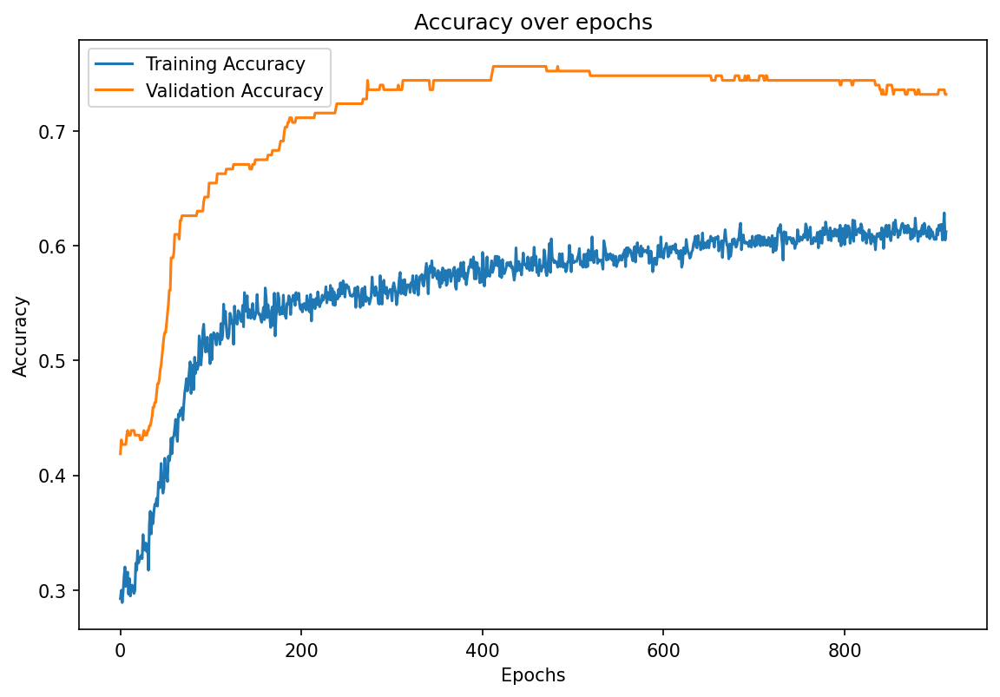

# Lexical Feature based Classifier

## Aim

This repository aims to build a classifier based on lexical features for generated questions. Some features may not be appropriated for this task, because questions are short pieces of text, which limits the range for features such as number of plural nouns, verb-related features, etc. However, some features based on lemma frequency and NER-based feature may still be usefull.  

We will first try to extract the features from the data using a Feature Extractor tool.  

Then we will build a simple feature-based classifier with PyTorch and optimize it with AdamW.

## Feature extraction

The code for feature extraction can be found in the feature_extractor directory. It is taken from another git repository, so no further information on that part will be given in this repo.

## Data

At first, we will focus on the file data/108-goodbad.csv which contains questions and their quality. This file isn't included in the git repository because it isn't public, but those concerned may find it in /shared.  
A curated version of this file can be obtained by running the notebook/curate-108.ipynb notebook with appropriate paths, in which case the file data/curated-108.json should appear. This file can be loaded with the following snippet:

```{.py}
from data import load_108

dataframe = load_108()
```

## Classifier

Then, we leverage a simple model made of two linear layers with a hidden size __H__, a dropout layer with probability __p__ and a ReLu activation.  
This model is trained on 60% of the data with 40% allocated to validation. The traning data isn't balanced and is heavily favored towards postives, so the loss function used, cross entropy, is weighted in consequence. However, the validation data is balanced, so that the accuracy measurement on validation may be reliable. No test data is gathered from 108-goodbad.csv, as testing will be done on other data.  
The optimizer used is AdamW with a learning rate of λ and a batch size of B.  
The training has an early-stopping callback with patience of 500 and warmup of 100. Without early stopping, which never happens, it is set to run for 10000 epochs. This isn't a problem, as the problem's size is small enough to allow for fast training.  
Through cross-training, we found the following values to be the best for the hyper-parameters:  

<div align="center">

| __H__ | __p__ | λ | B |
| ------------- | --- | --------- | ------------- |
| 200           | 0.4 | 4e-05     | 256           |

</div>

The cross-training process can be found in classifier-cross.ipynb .

The final validation accuracy is 0.7560975609756099 The final validation accuracy is 0.7560975609756099 ~ 0.76 .

For reproducibility reasons, the seed used for every step is 42.

<div align="center">




</div>